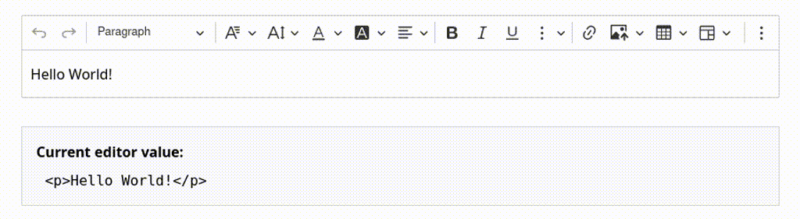

# CKEditor 5 Phoenix Integration ✨

[](LICENSE)
[](http://makeapullrequest.com)

[](https://github.com/Mati365/ckeditor5-phoenix/issues)
[](https://coveralls.io/github/Mati365/ckeditor5-phoenix?branch=main)
[](https://codecov.io/gh/Mati365/ckeditor5-phoenix?flag=npm)


CKEditor 5 integration library for Phoenix (Elixir) applications. Provides web components and helper functions for seamless editor integration with support for classic, inline, balloon, and decoupled editor types.

> [!IMPORTANT]
> This package is unofficial and not maintained by CKSource. For official CKEditor 5 documentation, visit [ckeditor.com](https://ckeditor.com/docs/ckeditor5/latest/). If you encounter any issues in the editor, please report them on the [GitHub repository](https://github.com/ckeditor/ckeditor5/issues).

<!-- markdownlint-disable MD033 -->
<p align="center">
  
</p>

## Table of Contents

- [CKEditor 5 Phoenix Integration ✨](#ckeditor-5-phoenix-integration-)
  - [Table of Contents](#table-of-contents)
  - [Installation 🚀](#installation-)
    - [🏠 Self-hosted](#-self-hosted)
    - [📡 CDN Distribution](#-cdn-distribution)
  - [Basic Usage 🏁](#basic-usage-)
    - [Simple Editor ✏️](#simple-editor-️)
    - [Watchdog prop 🐶](#watchdog-prop-)
      - [Disabling the watchdog 🚫](#disabling-the-watchdog-)
    - [With LiveView Sync 🔄](#with-liveview-sync-)
      - [Focus and blur events 👁️‍🗨️](#focus-and-blur-events-️️)
      - [Two-way Communication 🔄](#two-way-communication-)
        - [From JavaScript to Phoenix (Client → Server) 📤](#from-javascript-to-phoenix-client--server-)
        - [From Phoenix to JavaScript (Server → Client) 📥](#from-phoenix-to-javascript-server--client-)
  - [Editor Types 🖊️](#editor-types-️)
    - [Classic editor 📝](#classic-editor-)
    - [Multiroot editor 🌳](#multiroot-editor-)
    - [Inline editor 📝](#inline-editor-)
    - [Decoupled editor 🌐](#decoupled-editor-)
  - [Forms Integration 🧾](#forms-integration-)
    - [Phoenix Form Helper 🧑‍💻](#phoenix-form-helper-)
    - [LiveView Handler ⚡](#liveview-handler-)
  - [Image Upload 🖼️](#image-upload-️)
    - [Enabling uploads 🚀](#enabling-uploads-)
    - [Base64 Uploads 🖼️](#base64-uploads-️)
    - [Backend Handling 📥](#backend-handling-)
      - [Using Built-in Controller 📦](#using-built-in-controller-)
      - [Custom Controller 🛠️](#custom-controller-️)
    - [CSRF Protection 🛡️](#csrf-protection-️)
  - [Configuration ⚙️](#configuration-️)
    - [Custom Presets 🧩](#custom-presets-)
    - [Dynamic presets 🎯](#dynamic-presets-)
    - [Providing the License Key 🗝️](#providing-the-license-key-️)
    - [Referencing DOM Elements in Config 🏷️](#referencing-dom-elements-in-config-️)
  - [Localization 🌍](#localization-)
    - [UI language and content language 🈯](#ui-language-and-content-language-)
    - [Global Translation Config 🛠️](#global-translation-config-️)
    - [Custom translations 🌐](#custom-translations-)
  - [Custom plugins 🧩](#custom-plugins-)
  - [Context 🤝](#context-)
    - [Basic usage 🔧](#basic-usage--1)
    - [Custom context translations 🌐](#custom-context-translations-)
  - [Watch registered editors 👀](#watch-registered-editors-)
    - [Wait for particular editor to be registered ⏳](#wait-for-particular-editor-to-be-registered-)
  - [Package development 🛠️](#package-development-️)
  - [Psst... 👀](#psst-)
  - [Trademarks 📜](#trademarks-)
  - [License 📜](#license-)

## Installation 🚀

Choose between two installation methods based on your needs. Both approaches provide the same functionality but differ in how CKEditor 5 assets are loaded and managed.

### 🏠 Self-hosted

Bundle CKEditor 5 with your application for full control over assets, custom builds, and offline support. This method is recommended for advanced users or production applications with specific requirements. It's also GPL-compliant.

**Complete setup:**

1. **Add dependency** to your `mix.exs`:

   ```elixir
   def deps do
     [
       {:ckeditor5_phoenix, "~> 1.17.0"}
     ]
   end
   ```

2. **Install CKEditor 5**

   ```bash
   mix ckeditor5.install # --premium --version 47.3.0
   # ... or: npm install ckeditor5 --prefix assets
   ```

3. **Add `ckeditor5.install` to `assets.setup` in `mix.exs`** (if using Mix installer):

   ```elixir
   "assets.setup": ["ckeditor5.install", ... ]
   ```

4. **Register JavaScript hook** in your `app.js`:

   ```javascript
   import { Hooks } from 'ckeditor5_phoenix';

   const liveSocket = new LiveSocket('/live', Socket, {
     hooks: Hooks,
   });
   ```

5. **Import styles** in your `assets/css/app.css`:

   ```css
   @import "../../deps/ckeditor5/dist/ckeditor5.css";
   /* ... or: @import "../node_modules/ckeditor5/dist/ckeditor5.css"; */
   ```

6. **Import module in View**

   ```elixir
   defmodule MyAppWeb.PageHTML do
     # ... your other uses
     use CKEditor5
   end
   ```

7. **Use in templates** (no CDN assets needed):

   ```heex
   <.ckeditor id="editor" type="classic" value="<p>Hello world!</p>" />
   ```

### 📡 CDN Distribution

Load CKEditor 5 directly from CKSource's CDN - no build configuration required. This method is ideal for most users who want quick setup and don't need custom builds.

**Complete setup:**

1. **Add dependency** to your `mix.exs`:

   ```elixir
   def deps do
     [
       {:ckeditor5_phoenix, "~> 1.17.0"}
     ]
   end
   ```

2. **Register JavaScript hook** in your `app.js`:

   ```javascript
   import { Hooks } from 'ckeditor5_phoenix';

   const liveSocket = new LiveSocket('/live', Socket, {
     hooks: Hooks,
   });
   ```

3. **Exclude CKEditor from bundler** in your `config/config.exs`:

   ```elixir
   config :my_app, MyAppWeb.Endpoint,
     watchers: [
       esbuild: {Esbuild, :install_and_run, [
         :my_app,
         ~w(--external:ckeditor5 --external:ckeditor5-premium-features)
       ]}
     ]
   ```

4. **Add license key** (see [Providing the License Key 🗝️](#providing-the-license-key-️) section)

5. **Import module in View**

   ```elixir
   defmodule MyAppWeb.PageHTML do
     # ... your other uses
     use CKEditor5
   end
   ```

6. **Use in templates:**

   ```heex
   <%!-- Load CDN assets in <head> (based on `default` preset) --%>
   <.cke_cloud_assets />

   <%!-- or with specific features (overrides `default` preset) --%>
   <.cke_cloud_assets translations={["pl", "de", "fr"]} premium />

   <%!-- or with specific preset --%>
   <.cke_cloud_assets preset="inline" />

   <%!-- Use editor anywhere in <body> --%>
   <.ckeditor id="editor" type="classic" value="<p>Hello world!</p>" />
   ```

That's it! 🎉

## Basic Usage 🏁

Get started with the most common usage patterns. These examples show how to render editors in your templates and handle real-time content changes.

### Simple Editor ✏️

Create a basic editor with default toolbar and features. Perfect for simple content editing without server synchronization.

```heex
<%!-- CDN only: Load assets in <head> --%>
<.cke_cloud_assets />

<%!-- Render editor with initial content --%>
<.ckeditor
  id="editor"
  type="classic"
  value="<p>Initial content</p>"
  editable_height="300px"
/>
```

### Watchdog prop 🐶

By default, the `<.ckeditor>` component uses a built-in watchdog mechanism to automatically restart the editor if it crashes (e.g., due to a JavaScript error). The watchdog periodically saves the editor's content and restores it after a crash, minimizing the risk of data loss for users.

#### Disabling the watchdog 🚫

The watchdog is enabled by default. To disable it, set the `watchdog` prop to `false`:

```heex
<.ckeditor
  type="classic"
  value="<p>Initial content</p>"
  watchdog={false}
/>
```

### With LiveView Sync 🔄

Enable real-time synchronization between the editor and your LiveView. Content changes are automatically sent to the server with configurable debouncing for performance optimization.



#### Focus and blur events 👁️‍🗨️

To handle focus and blur events, you can use the `focus_event` and `blur_event` attributes in the component. This allows you to capture when the editor gains or loses focus, which can be useful for tracking user interactions or saving content.

```heex
<.ckeditor
  id="editor"
  value={@content}
  focus_event
  blur_event
/>
```

```elixir
def handle_event("ckeditor5:focus", %{"data" => data}, socket) do
  {:noreply, assign(socket, content: data["main"])}
end

def handle_event("ckeditor5:blur", %{"data" => data}, socket) do
  {:noreply, assign(socket, content: data["main"])}
end
```

These events are sent **immediately** when the editor gains or loses focus, allowing you to perform actions like saving content or updating UI elements.

#### Two-way Communication 🔄

CKEditor 5 Phoenix supports bidirectional communication between your LiveView server and the JavaScript editor instance. This allows you to both receive updates from the editor and programmatically control it from your Elixir code.

##### From JavaScript to Phoenix (Client → Server) 📤

The editor automatically sends events to your LiveView when content changes, focus changes, or other interactions occur. These events are handled in your LiveView module using standard `handle_event/3` callbacks.

```heex
<.ckeditor
  id="editor"
  value={@content}
  change_event
/>
```

```elixir
defmodule MyAppWeb.EditorLive do
  use MyAppWeb, :live_view
  use CKEditor5

  def mount(_params, _session, socket) do
    {:ok, assign(socket, content: "<p>Initial content</p>", focused?: false)}
  end

  # Receive content updates from editor
  def handle_event("ckeditor5:change", %{"data" => data}, socket) do
    {:noreply, assign(socket, content: data["main"])}
  end
end
```

##### From Phoenix to JavaScript (Server → Client) 📥

You can programmatically update the editor content from your LiveView by pushing events to the client. This is useful for scenarios like:

```heex
<.ckeditor
  id="editor"
  value={@content}
  change_event
/>

<button phx-click="load_template">Load Template</button>
<button phx-click="reset_content">Reset</button>
```

```elixir
defmodule MyAppWeb.EditorLive do
  use MyAppWeb, :live_view
  use CKEditor5

  def mount(_params, _session, socket) do
    {:ok, assign(socket, content: "<p>Initial content</p>")}
  end

  # Update editor content from server
  def handle_event("load_template", _params, socket) do
    template_content = """
    <h1>Article Template</h1>
    <p>Start writing your article here...</p>
    <h2>Section 1</h2>
    <p>Content goes here.</p>
    """

    {:noreply,
     socket
     |> push_event("ckeditor5:set-data", %{
       editorId: "editor",
       data: template_content
     })}
  end

  def handle_event("reset_content", _params, socket) do
    {:noreply,
     socket
     |> push_event("ckeditor5:set-data", %{
       editorId: "editor",
       data: "<p>Reset to empty state</p>"
     })}
  end

  # Still handle incoming changes from editor
  def handle_event("ckeditor5:change", %{"data" => data}, socket) do
    {:noreply, assign(socket, content: data["main"])}
  end
end
```

## Editor Types 🖊️

CKEditor 5 Phoenix supports four distinct editor types, each designed for specific use cases. Choose the one that best fits your application's layout and functionality requirements.

### Classic editor 📝

Traditional WYSIWYG editor with a fixed toolbar above the editing area. Best for standard content editing scenarios like blog posts, articles, or forms.


```heex
<%!-- CDN assets in <head> --%>
<.cke_cloud_assets />

<%!-- Classic editor in <body> --%>
<.ckeditor
  type="classic"
  value="<p>Initial content here</p>"
  editable_height="300px"
/>
```

### Multiroot editor 🌳

Advanced editor supporting multiple independent editable areas within a single editor instance. Perfect for complex layouts like page builders, newsletters, or multi-section content management.


```heex
<%!-- CDN assets in <head> --%>
<.cke_cloud_assets />

<%!-- Editor container --%>
<.ckeditor type="multiroot" />

<%!-- Shared toolbar --%>
<.cke_ui_part name="toolbar" />

<%!-- Multiple editable areas --%>
<div class="flex flex-col gap-4">
  <.cke_editable
    root="header"
    value="<h1>Main Header</h1>"
    class="border border-gray-300"
  />
  <.cke_editable
    root="content"
    value="<p>Main content area</p>"
    class="border border-gray-300"
  />
  <.cke_editable
    root="sidebar"
    value="<p>Sidebar content</p>"
    class="border border-gray-300"
  />
</div>
```

### Inline editor 📝

Minimalist editor that appears directly within content when clicked. Ideal for in-place editing scenarios where the editing interface should be invisible until needed.


```heex
<%!-- CDN assets in <head> --%>
<.cke_cloud_assets />

<%!-- Inline editor --%>
<.ckeditor
  type="inline"
  value="<p>Click here to edit this content</p>"
  editable_height="300px"
/>
```

**Note:** Inline editors don't work with `<textarea>` elements and may not be suitable for traditional form scenarios.

### Decoupled editor 🌐

Flexible editor where toolbar and editing area are completely separated. Provides maximum layout control for custom interfaces and complex applications.


```heex
<%!-- CDN assets in <head> --%>
<.cke_cloud_assets />

<%!-- Decoupled editor container --%>
<.ckeditor id="your-editor" type="decoupled">
  <div class="flex flex-col gap-4">
    <%!-- Toolbar can be placed anywhere --%>
    <.cke_ui_part name="toolbar" />

    <%!-- Editable area with custom styling --%>
    <.cke_editable
      value="<p>Initial content here</p>"
      class="border border-gray-300 p-4 rounded"
      editable_height="300px"
    />
  </div>
</.ckeditor>
```

## Forms Integration 🧾

Seamlessly integrate CKEditor 5 with Phoenix forms and LiveView for robust content management. Learn how to handle form submissions and real-time updates.

### Phoenix Form Helper 🧑‍💻

The editor automatically creates hidden input fields for form integration. Content is synchronized with form fields using the `field` attribute, making it compatible with standard Phoenix form helpers.

```heex
<.form for={@form} phx-submit="save">
  <.ckeditor id="content-editor" field={@form[:content]} />

  <button type="submit">Save</button>
</.form>
```

### LiveView Handler ⚡

Complete LiveView integration with event handling for both real-time updates and form processing.

```elixir
defmodule MyApp.PageLive do
  use MyAppWeb, :live_view
  use CKEditor5  # Adds event handlers

  def mount(_params, _session, socket) do
    form = to_form(%{"content" => ""}, as: :form)
    {:ok, assign(socket, form: form)}
  end

  # Handle real-time content changes
  def handle_event("ckeditor5:change", %{"data" => data}, socket) do
    # Update content in real-time
    updated_params = Map.put(socket.assigns.form.params, "content", data["main"])
    {:noreply, assign(socket, form: to_form(updated_params, as: :form))}
  end

  # Handle form validation
  def handle_event("validate", %{"form" => params}, socket) do
    {:noreply, assign(socket, form: to_form(params, as: :form))}
  end

  # Handle form submission
  def handle_event("save", %{"form" => params}, socket) do
    # Process and save form data
    case save_content(params) do
      {:ok, _} ->
        {:noreply, put_flash(socket, :info, "Content saved successfully!")}
      {:error, _} ->
        {:noreply, put_flash(socket, :error, "Failed to save content")}
    end
  end
end
```

## Image Upload 🖼️

CKEditor 5 Phoenix includes a dedicated upload adapter that integrates seamlessly with Phoenix applications. It handles image uploads using standard `multipart/form-data` requests and automatically includes CSRF tokens.

### Enabling uploads 🚀

To enable image uploads, simply provide the `upload_url` prop to the editor component. This URL should point to your Phoenix controller action that handles the file upload.

```heex
<.ckeditor
  id="editor"
  upload_url="/api/uploads"
  value="<p>Content with images</p>"
/>
```

Alternatively, you can configure the upload URL globally in your `config/config.exs`:

```elixir
config :ckeditor5_phoenix, :uploads, api_url: "/api/uploads"
```

When `upload_url` is configured (either via prop or globally), the editor will automatically:

1. Enable the `PhoenixUploadAdapter` plugin.
2. Disable conflicting adapters (like `SimpleUploadAdapter` or `Base64UploadAdapter`).
3. Send upload requests to the specified URL.

### Base64 Uploads 🖼️

If you prefer to store images as Base64 strings directly in the content (not recommended for production due to performance impact), you can set `upload_url` to `"base64"`.

```heex
<.ckeditor
  id="editor"
  upload_url="base64"
  value="<p>Content with images</p>"
/>
```

This will enable the `Base64UploadAdapter` and disable other upload adapters. It's default behavior if no `upload_url` is provided nor global configuration exists.

### Backend Handling 📥

The editor expects the server to return a JSON response containing the URL of the uploaded file:

```json
{
  "url": "https://example.com/images/foo.jpg"
}
```

In case of an error, return a JSON object with an error message:

```json
{
  "error": {
    "message": "File too big."
  }
}
```

#### Using Built-in Controller 📦

The package includes a ready-to-use `CKEditor5.Upload.Controller` that handles local file storage. To use it:

1. **Configure storage location**:

   ```elixir
   config :ckeditor5_phoenix, :uploads,
     folder: "priv/static/uploads",
     api_url: "/api/ckeditor5/uploads",
     url: "/uploads" # Base URL for serving files
   ```

2. **Add route** in your `router.ex`:

   ```elixir
   scope "/api/ckeditor5" do
     pipe_through :api # Ensure this pipeline expects JSON

     post "/upload", CKEditor5.Upload.Controller, :upload
   end
   ```

#### Custom Controller 🛠️

If you need custom logic (e.g., uploading to S3), create your own controller. The `folder` and `url` config options are not needed in this case. However, make sure `api_url` is set correctly.

```elixir
defmodule MyAppWeb.UploadController do
  use MyAppWeb, :controller

  def upload(conn, %{"file" => upload}) do
    # 1. Handle the upload (e.g., store in S3)
    # 2. Return the public URL
    json(conn, %{url: "https://my-bucket.s3.amazonaws.com/..."})
  end
end
```

### CSRF Protection 🛡️

The adapter automatically fetches the CSRF token from the `meta[name="csrf-token"]` tag or `_csrf_token` cookie and sends it in the `X-CSRF-Token` header.

However, standard Phoenix `:api` pipelines often **do not** include CSRF protection by default. To secure your upload endpoint, ensure your pipeline includes the verification plug:

```elixir
pipeline :api do
  plug :accepts, ["json"]
  plug :fetch_session  # Required for CSRF protection
  plug :protect_from_forgery
end
```

## Configuration ⚙️

You can configure the editor _presets_ in your `config/config.exs` file. The default preset is `:default`, which provides a basic configuration with a toolbar and essential plugins. The preset is a map that contains the editor configuration, including the toolbar items and plugins. There can be multiple presets, and you can switch between them by passing the `preset` keyword argument to the `ckeditor` component.

### Custom Presets 🧩

In order to override the default preset or add custom presets, you can add the following configuration to your `config/config.exs` file:

```elixir
# config/config.exs
config :ckeditor5_phoenix,
  presets: %{
    minimal: %{
      cloud: %{
        version: "46.0.0",
        premium: true,
        translations: ["pl"],
        ckbox: %{
          version: "1.0.0"
        }
      },
      config: %{
        toolbar: [:bold, :italic, :link],
        plugins: [:Bold, :Italic, :Link, :Essentials, :Paragraph]
      }
    },
    full: %{
      config: %{
        toolbar: [
          :heading, :|, :bold, :italic, :underline, :|,
          :link, :insertImage, :insertTable, :|,
          :bulletedList, :numberedList, :blockQuote
        ],
        plugins: [
          :Heading, :Bold, :Italic, :Underline, :Link,
          :ImageBlock, :ImageUpload, :Table, :List, :BlockQuote,
          :Essentials, :Paragraph
        ]
      }
    }
  }
```

In template:

```heex
<.ckeditor preset="minimal" value="<p>Simple editor</p>" />
```

### Dynamic presets 🎯

You can also create dynamic presets that can be modified at runtime. This is useful if you want to change the editor configuration based on user input or other conditions.

```elixir
defmodule MyApp.PageLive do
  use MyAppWeb, :live_view
  use CKEditor5

  alias CKEditor5.Preset

  def mount(_params, _session, socket) do
    preset = Preset.Parser.parse!(%{
      config: %{
        toolbar: [:bold, :italic, :link],
        plugins: [:Bold, :Italic, :Link, :Essentials, :Paragraph]
      }
    })

    {:ok, assign(socket, preset: preset)}
  end
end
```

In template:

```heex
<.ckeditor preset={@preset} />
````

### Providing the License Key 🗝️

CKEditor 5 requires a license key when using the official CDN or premium features. You can provide the license key in two simple ways:

1. **Environment variable**: Set the `CKEDITOR5_LICENSE_KEY` environment variable before starting your Phoenix app. This is the easiest and most common way.
2. **Preset config**: You can also set the license key directly in your preset configuration in `config/config.exs`:

   ```elixir
   config :ckeditor5_phoenix,
     presets: %{
       default: %{
         license_key: "your-license-key-here"
       }
     }
   ```

If you use CKEditor 5 under the GPL license, you do not need to provide a license key. However, if you choose to set one, it must be set to `GPL`.

If both are set, the preset config takes priority. For more details, see the [CKEditor 5 licensing guide](https://ckeditor.com/docs/ckeditor5/latest/getting-started/licensing/license-and-legal.html).

### Referencing DOM Elements in Config 🏷️

You can reference DOM elements directly in your editor configuration using the special `{ $element: "selector" }` format. This is useful when you want to attach the editor's UI parts (like toolbars or editable areas) to specific elements in your HTML.

```elixir
# config/config.exs
config :ckeditor5_phoenix,
  presets: %{
    # ... other presets
    minimal: %{
      config: %{
        # ... other config
        yourPlugin: %{
          toolbar: %{ $element: "#my-toolbar" },
          editable: %{ $element: "#my-editable" }
        },
      }
    }
  }
```

This will find the elements with IDs `my-toolbar` and `my-editable` in the DOM and use them for the editor's UI.

⚠️ If the element is not found, a warning will be shown in the console.

## Localization 🌍

Support multiple languages in the editor UI and content. Learn how to load translations via CDN or configure them globally.

### UI language and content language 🈯

Use `language` to set the CKEditor UI language (menus, tooltips, labels) and `content_language` to set the language of the editable content (`lang` attribute in the editor area).

```heex
<.cke_cloud_assets translations={["pl"]} />

<.ckeditor
  id="article-editor"
  type="classic"
  language="pl"
  content_language="en"
  value="<p>Hello world!</p>"
/>
```

### Global Translation Config 🛠️

You can also configure translations globally in your `config/config.exs` file. This is useful if you want to load translations for multiple languages at once or set a default language for the editor. Keep in mind that this configuration is only used when loading translations via CDN. If you are using self-hosted setup, translations are handled by your bundler automatically.

```elixir
# config/config.exs
config :ckeditor5_phoenix,
  presets: %{
    default: %{
      cloud: %{
        translations: ["pl", "de", "fr"]  # CDN only
      }
    }
  }
```

**Note:** For self-hosted setups, translations are handled by your bundler automatically.

### Custom translations 🌐

You can also provide custom translations for the editor. This is useful if you want to override existing translations or add new ones. Custom translations can be provided in the preset configuration.

```elixir
# config/config.exs
config :ckeditor5_phoenix,
  presets: %{
    default: %{
      custom_translations: %{
        en: %{
          Bold: "Custom Bold",
          Italic: "Custom Italic"
        },
        pl: %{
          Bold: "Pogrubiony",
          Italic: "Kursywa"
        }
      }
    }
  }
```

## Custom plugins 🧩

To register a custom plugin, use the `registerCustomEditorPlugin` function. This function takes the plugin name and the plugin _reader_ that returns a class extending `Plugin`.

```javascript
import { CustomEditorPluginsRegistry as Registry } from 'ckeditor5_phoenix';

const unregister = Registry.the.register('MyCustomPlugin', async () => {
  // It's recommended to use lazy import to
  // avoid bundling ckeditor code in your application bundle.
  const { Plugin } = await import('ckeditor5');

  return class extends Plugin {
    static get pluginName() {
      return 'MyCustomPlugin';
    }

    init() {
      console.log('MyCustomPlugin initialized');
      // Custom plugin logic here
    }
  };
});
```

In order to use the plugin you need to extend your config in `config/config.exs`:

```elixir
config :ckeditor5_phoenix,
  presets: %{
    default: %{
      config: %{
        plugins: [:MyCustomPlugin, :Essentials, :Paragraph],
        # ... other config options
      }
    }
  }
```

It must be called before the editor is initialized. You can unregister the plugin later by calling the returned function:

```javascript
unregister();
// or CustomEditorPluginsRegistry.the.unregister('MyCustomPlugin');
```

If you want to de-register all registered plugins, you can use the `unregisterAll` method:

```javascript
import { CustomEditorPluginsRegistry } from 'ckeditor5_phoenix';

CustomEditorPluginsRegistry.the.unregisterAll();
```

## Context 🤝

The **context** feature is designed to group multiple editor instances together, allowing them to share a common context. This is particularly useful in collaborative editing scenarios, where users can work together in real time. By sharing a context, editors can synchronize features such as comments, track changes, and presence indicators across different editor instances. This enables seamless collaboration and advanced workflows in your Phoenix application.

For more information about the context feature, see the [CKEditor 5 Context documentation](https://ckeditor.com/docs/ckeditor5/latest/features/collaboration/context-and-collaboration-features.html).


### Basic usage 🔧

Define your context in configuration:

```elixir
config :ckeditor5_phoenix,
  contexts: %{
    "your-context" => %{
      config: %{
        plugins: [
          :CustomContextPlugin
        ]
      },
      watchdog: %{
        crash_number_limit: 20
      }
    }
  },
  presets: %{
    # ...
  }
```

And use it in your LiveView:

```heex
<.cke_context context="your-context">
  <.ckeditor class="mb-6" value="Child A" />
  <.ckeditor value="Child B" />
</.cke_context>
```

Voila!

> [!NOTE]
> The `context` attribute accepts also `CKEditor5.Context` structure, so it can be used in LiveView assigns or other dynamic contexts.

### Custom context translations 🌐

Define your custom translations in the configuration:

```elixir
config :ckeditor5_phoenix,
  contexts: %{
    "custom" => %{
      # ...
      custom_translations: %{
        en: %{
          Bold: "Custom Bold",
          Italic: "Custom Italic"
        },
        pl: %{
          Bold: "Pogrubiony",
          Italic: "Kursywa"
        }
      }
    }
  }
```

These translations will be used in the context's editors, overriding the default translations. They are available through `locale.t` plugin in every context plugin.

## Watch registered editors 👀

You can watch the registered editors using the `watch` function. This is useful if you want to react to changes in the registered editors, for example, to update the UI or perform some actions when an editor is added or removed.

```javascript
import { EditorsRegistry } from 'ckeditor5_phoenix';

const unregisterWatcher = EditorsRegistry.the.watch((editors) => {
  console.log('Registered editors changed:', editors);
});

// Later, you can unregister the watcher
unregisterWatcher();
```

### Wait for particular editor to be registered ⏳

You can also wait for a specific editor to be registered using the `waitForEditor` function. This is useful if you want to perform some actions after a specific editor is registered.

This method can be called before the editor is initialized, and it will resolve when the editor is registered.

```javascript
import { EditorsRegistry } from 'ckeditor5_phoenix';

EditorsRegistry.the.waitFor('editor1').then((editor) => {
  console.log('Editor "editor1" is registered:', editor);
});

// ... init editor somewhere later
```

The `id` of the editor must be used to identify the editor. If the editor is already registered, the promise will resolve immediately.

## Package development 🛠️

In order to contribute to CKEditor 5 Phoenix or run it locally for manual testing, here are some handy commands to get you started.

To run the minimal Phoenix application with CKEditor 5 integration, install dependencies and start the server:

```bash
mix playground
```

In order to run the playground in cloud mode, set the `CKEDITOR5_PLAYGROUND_MODE` environment variable to `cloud`:

```bash
CKEDITOR5_PLAYGROUND_MODE=cloud mix playground
```

Run tests using the `mix test` command. All tests are located in the `test/` directory.

```bash
mix test
```

To generate a code coverage report, use:

```bash
mix coveralls.html
```

## Psst... 👀

Discover related projects for other frameworks and languages. Find inspiration or alternative integrations for CKEditor 5.

Looking for similar projects or inspiration? Check out these repositories:

- [ckeditor5-rails](https://github.com/Mati365/ckeditor5-rails)
  Effortless CKEditor 5 integration for Ruby on Rails. Works seamlessly with standard forms, Turbo, and Hotwire. Easy setup, custom builds, and localization support.

- [ckeditor5-livewire](https://github.com/Mati365/ckeditor5-livewire)
  Plug-and-play CKEditor 5 solution for Laravel + Livewire applications. Fully compatible with Blade forms. Includes JavaScript hooks, flexible configuration, and easy customization.

- [ckeditor5-symfony](https://github.com/Mati365/ckeditor5-symfony)
  Native CKEditor 5 integration for Symfony. Works with Symfony 6.x+, standard forms and Twig. Supports custom builds, multiple editor configurations, asset management, and localization. Designed to be simple, predictable, and framework-native.

## Trademarks 📜

Information about CKEditor® trademarks and licensing. Clarifies the relationship between this package and CKSource.

CKEditor® is a trademark of [CKSource Holding sp. z o.o.](https://cksource.com/) All rights reserved. For more information about the license of CKEditor® please visit [CKEditor's licensing page](https://ckeditor.com/legal/ckeditor-oss-license/).

This package is not owned by CKSource and does not use the CKEditor® trademark for commercial purposes. It should not be associated with or considered an official CKSource product.

## License 📜

Details about the MIT license for this project and CKEditor 5's GPL license. Make sure to review both licenses for compliance.

This project is licensed under the terms of the [MIT LICENSE](LICENSE).

This project injects CKEditor 5 which is licensed under the terms of [GNU General Public License Version 2 or later](https://www.gnu.org/licenses/old-licenses/gpl-2.0.html). For more information about CKEditor 5 licensing, please see their [official documentation](https://ckeditor.com/legal/ckeditor-oss-license/).
